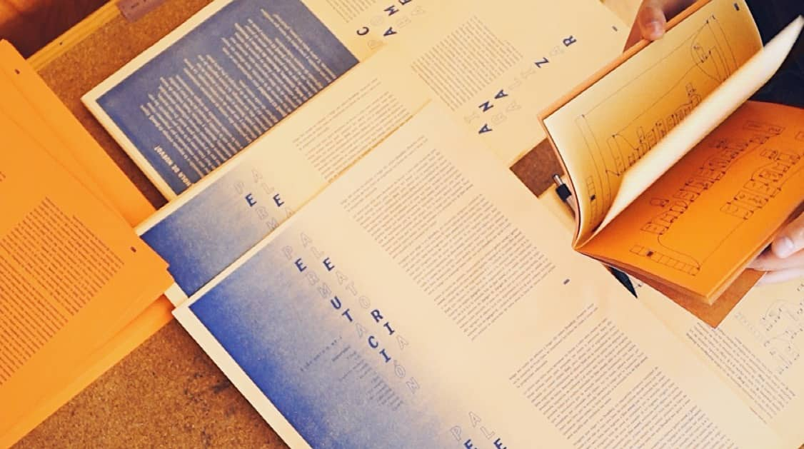

# iomfanzine-RAW

Manuscritos en _markdown_ de los fanzines impresos junto con sus respectivas imágenes y patches. Utilice estos archivos para remezcla, consulta o referencia. 

Documentos bajo licencia Creative Commons Attribution 4.0 International (CC BY 4.0)

---

Considere apoyar el proyecto contactándonos a <iom.fanzine@gmail.com> para obtener las versiones impresas que preparamos con dedicación y amor.

**[iom!] Experimentos rítmicos en Pure Data**

**Edición:** Isaac Medina y Paola Sandoval

**Textos:** Isaac Medina

**Diseño editorial:** Paola Sandoval